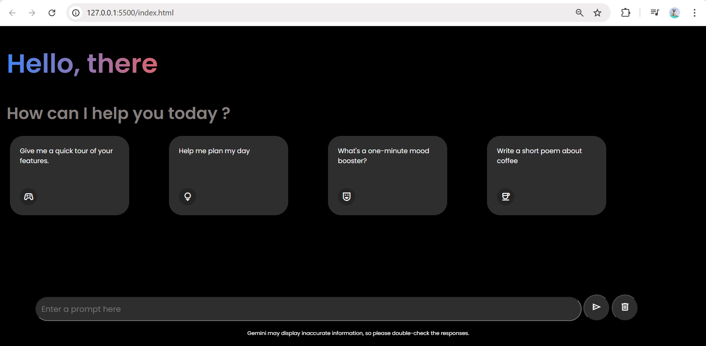
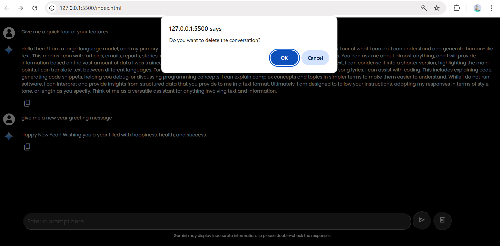

# Chatbot-Clone : Gemini-inspired 

 A conversational AI chatbot inspired by Google Gemini, designed to provide smart, responsive, and user-friendly interactions.   This project focuses on building an intuitive chat interface with real-time responses and a clean UI. 

 ## ✨ Features
- 💬 **Interactive Chat Interface**
- ⚡ **Clickable Example Prompts** displayed on screen for quick interaction
- 📨 **Send Button** to submit user messages
- 🧹 **Clear Chat Option** to reset the conversation instantly
- 🎨 **Clean & Responsive UI**
- 🔄 Smooth message flow  & loading animations for better user experience
- 🔑 API Integration: This project uses the real Gemini API to generate intelligent and meaningful responses in real time.

⚠️ Note:
The API key is expired and does not work now.  

## 🛠️ Technologies Used
- HTML  
- CSS  
- JavaScript

## 🚀 How It Works
User selects an example prompt or types a custom message.
Message is sent to the Gemini API.
AI-generated response is displayed in the chat window.
Users can continue the conversation or clear the chat anytime.

## 📸 Project Screenshots
 📌  
 📌   
 📌 🎥 Demo Video  
     final chatbot.mp4

